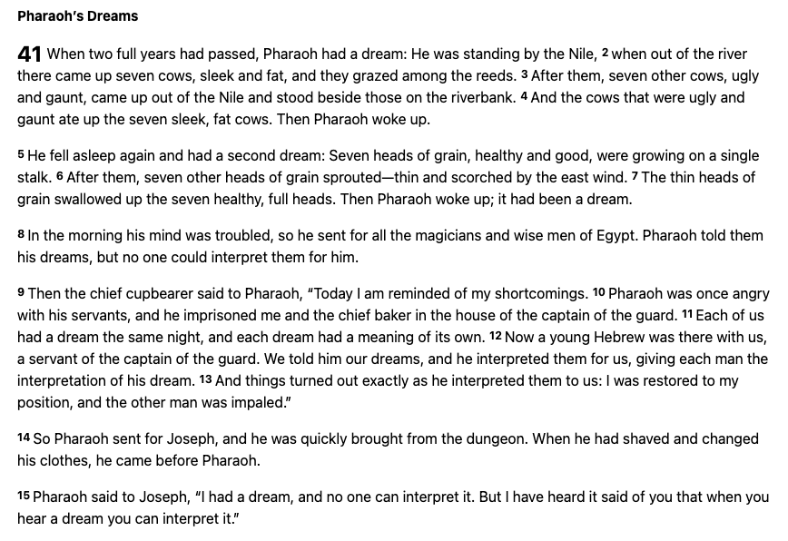
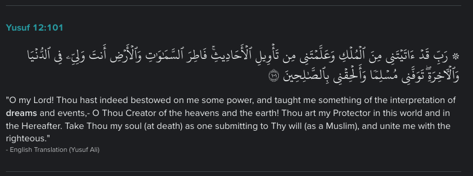

# Dream Log APP #

## INTRODUCTION ##

August Kekulé figured out the chemical configuration structure of Benzene. He notably says that he came about this discovery through a dream he had of a snake biting its own tail. August Kekulé, the scientist responsible for this contribution to field of organic chemistry has been proven to be correct today through various spectroscopic techniques. Other notable people who have had contributed to the modern world through inspiration from their dreams include Alfred Russel Wallace and Elias Howe who contributed to the field of Biological Populations and the invention of the sewing machine (respectively).

<!-- Thank you James Lee for informing the developer about the invention of the sewing machine through a dream -->

Everyone has dreams! This application is a digital journal built to keep track of the dreams that you had while sleeping! In the section about good dreams, bad dreams, or neutral dreams, it is totally up to User discretion to determine whether their dream was good or bad or neutral. An example of a good dream could be you wake up feeling happy and hopeful. An example of a bad dream could be waking up in a state of terror. A neutral dream could be something you dreamed about that happened in the previous day.

## SIMPLICITY & PRIVACY ##

This app was built focusing on user friendliness, simplicity, and privacy in mind. Since there is no database and everything is stored on the user's device locally, the user will not have to worry about their data being on someone else's computer. A future goals with this local app is to research forms of encryption and implement one of them. One node package that might do this is "react-secure-storage" from the site https://www.npmjs.com/package/react-secure-storage. Another goal is to allow users to download their information in the event they are upgrading their device and would need to bring their data over to their new device.

## USER STORY ##

*Here I will talk about how users can use the application.*

As a User, when I open the application, I see a home page with related information on the application's purpose. 

As a User, I can also see and hear a neat little sound bit created by the developer thought to remind the user of the categorizing of dreams in this application. The main three tones of the music is low, medium, then high, thus trying to resemble the categorization of a bad dream, a neutral dream, and a good dream. These three categorizations of dreams in this application has been inspired by the developer's cultural background.

As a User, I see different navigation links at the top of the page. Upon clicking "All Dreams", I am taken to all the dreams logged, which appears blanks before any input of dreams from the "New Form" page, found by clicking the "New Form" link at the top of the page.

<!-- ## MODERN DAY IMPLICATIONS ## -->

<!-- 
## MODERN DAY Medical/Secular USE ##

*PSYCHIATRY - SIGMUND F. (Patient Psycho-Analysis through their Dreams)*

“But dreams can be used, he contends, to help a patient understand that the conflicting emotions he is currently experiencing are complicated by older, unrecognized emotions that are still meaningful, but just beyond his conscious grasp, a bit like a word at the tip of the tongue that just won't come to mind.”

[Sigmund Freud statement from WEB-MD](https://www.webmd.com/mental-health/news/20010312/freudian-slip-do-dreams-still-have-role-in-psychiatry)

## MODERN DAY Religious/Cultural USE ##

*In various religious texts, dreams are used as a guidance through life if interpreted correctly.*

Here is an excerpt from the New International Version translation of the Bible:

[Joseph's Dream - https://www.biblegateway.com/](https://www.biblegateway.com/passage/?search=Genesis%2037%3A1-44%3A9&version=NIV)

Here is an excerpt from a translation from the Quran:

[Joseph's Dream - https://quran.com/](https://quran.com/12?startingVerse=101)

 -->

## Maximum Input ##

This site can take a maximum of approximately 5,000,000 characters in modern browser interfaces such as Chrome and FireFox. Anything more than this may lead to the app malfunctioning. This is because localStorage is used to save data locally on the browser instead of an external server. 

See "Find the maximum length of a single string that can be stored in localStorage" solution to problem in the following  [Stack OverFlow link](https://stackoverflow.com/questions/2989284/what-is-the-max-size-of-localstorage-values)

## ChatGPT Answer on LocalStorage Input Value Max Capacity ##

According to ChatGPT's answer, it is similar if not the same:

The amount of data that can be stored in 10 MB of local storage in JavaScript depends on several factors, including the specific browser implementation and any other data stored in the local storage.

In general, the maximum size of data that can be stored in local storage is around 5-10 MB. However, it's important to note that the actual amount of data you can store may be slightly less than the available space due to browser limitations and overhead.

When it comes to storing data in the form of strings, JavaScript uses the UTF-16 encoding, where each character is represented by 16 bits (2 bytes). This means that each character in a string will occupy 2 bytes of memory.

To estimate the amount of data you can store in 10 MB, you can use the following calculation:

10 MB = 10 * 1024 * 1024 bytes ≈ 10,485,760 bytes

Since each character in a string occupies 2 bytes, you can divide the available bytes by 2 to get an approximate number of characters:

10,485,760 bytes / 2 = 5,242,880 characters

Keep in mind that this is just an estimate, and the actual number of characters you can store may be slightly lower due to additional overhead and browser-specific limitations.

It's also worth noting that local storage is meant for storing small amounts of data such as preferences, settings, or small pieces of user-specific information. If you need to store a large amount of data or complex data structures, you might want to consider alternative storage options such as databases or file systems.